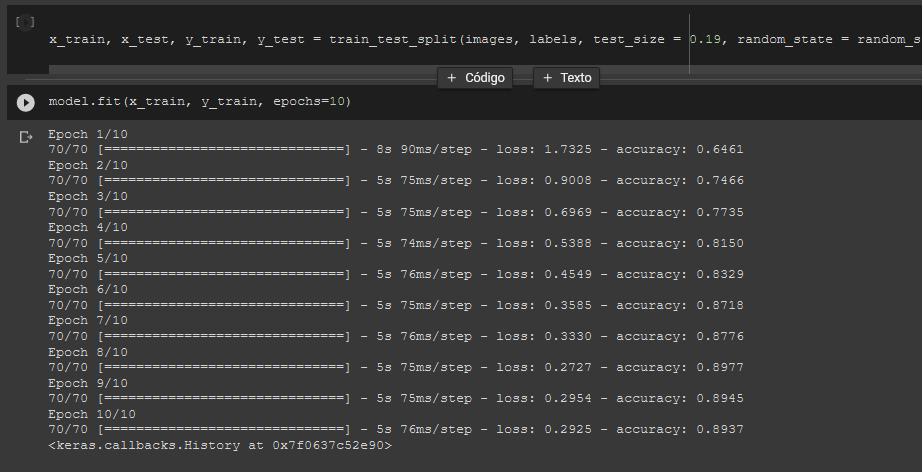
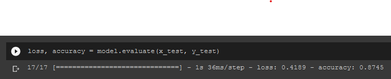
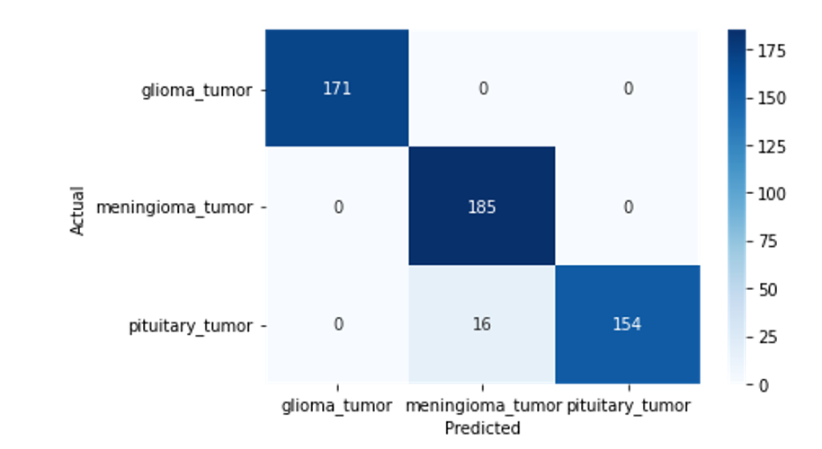
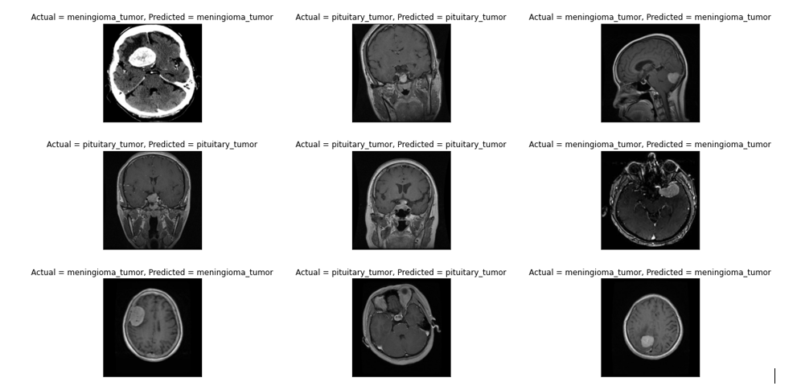

# Clasificación de Tumores Cerebrales Utilizando CNNs
El propósito de este repositorio es almacenar el código utilizado comparando dos arquitecturas personalizadas como son: 

  - [Resnet](https://keras.io/api/applications/resnet/)
  - [AlexNet](https://learnopencv.com/understanding-alexnet/) 
  
Se busca poder desarrollar un modelo que pueda identificar cada uno de los siguientes tumores, así como visualizar el porcentaje de certeza en cada uno de los modelos.
  - [**Glioma**](https://www.mayoclinic.org/es-es/diseases-conditions/glioma/symptoms-causes/syc-20350251)
  - [**Meningioma**](https://www.cancer.gov/rare-brain-spine-tumor/espanol/tumores/meningioma)
  - [**Pituitary**](https://www.mayoclinic.org/es-es/diseases-conditions/pituitary-tumors/symptoms-causes/syc-20350548)


## Paso 1: Dataset
Para entrenar este modelo, primero es necesario descargar el dataset de [Brain Tumor Classification](https://www.kaggle.com/sartajbhuvaji/brain-tumor-classification-mri) de Kaggle. Este archivo, llamado `archive.zip` se deberá colocar dentro del directorio `data`.

Una vez realizado este proceso, es necesario subir la carpeta `data` a la *raíz* de una unidad personal de [Google Drive](https://www.drive.google.com/). Este paso es fundamental debido a que la Notebook en Google Colab monta una unidad de Google Drive para poder extraer la información para entrenar el modelo.

Una vez realizados estos pasos, simplemente se deberá de correr la Notebook en su totalidad para poder extraer las imágenes. La Notebook contiene información más detallada acerca del proceso de entrenamiento y la exploración de los datos utilizados.

## Paso 2: Instalación de dependencias
Para instalar las dependencias
```
pip install -r requirements.txt
```
En caso de querer correr el programa fuera de jupyter notebook y si deseas correrlo dentro de un entorno virtual 
- Tutorial para instalación --> [venv](https://docs.python.org/3/tutorial/venv.html) 
- Una vez generado el ambiente virtual, aplicar el siguiente comando:
  ```
  python -m venv venv
  ```
- Instala las dependencias correspondientes a través del siguiente comando:
    ```
    pip install -r requirements.txt
    ```
## Arquitectura AlexNet
Como se puede ver a continuación se realizó el entrenamiento del modelo durante 10 épocas realizando el entrenamiento con un 80% de las imágenes dejando en reserva el 20% para testeo.

 
Finalmente se obtiene un resultado bastante bueno del 87% como se muestra a continuación :
 

Por otro lado se observa una cantidad de respuestas verdaderas correspondientes y correctas a cada categoría descrita inicialmente:



## Resultados obtenidos
Como se observó en los puntos anteriores, se obtuvo un mejor resultado por parte de la arquitectura AlexNet, obteniendo alrededor del 87% mientras que por parte de ResNet se obtuvo un porcentaje del aproximado del 60%. 
A continuación se puede visualizar la forma en como se realiza la predicción por parte del modelo y la clasificación real del tumor:

